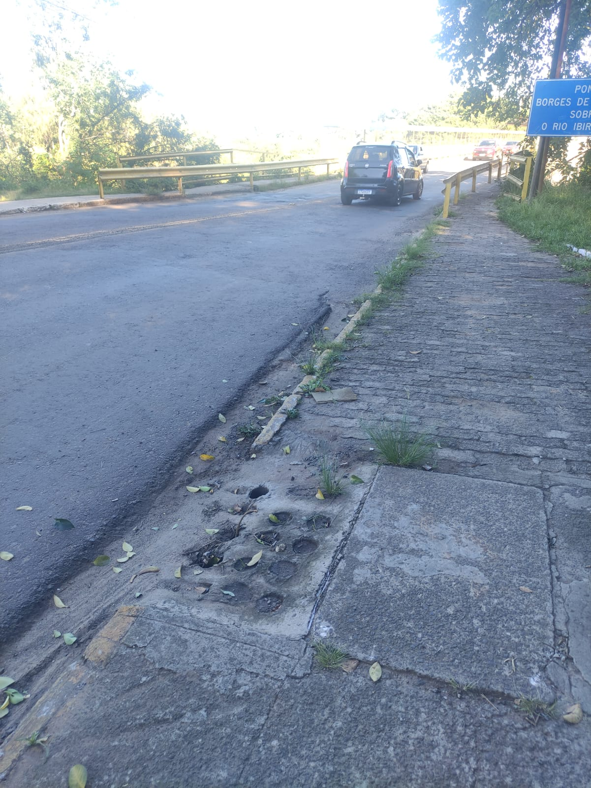
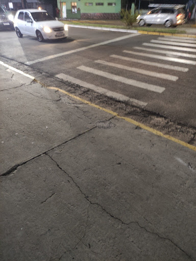

# Portfólio Reflexivo Individual (PRI) - Eduardo Prates
## Componente Curricular: Acessibilidade e Inclusão Digital

Este documento registra as aprendizagens teóricas e práticas desenvolvidas ao longo do semestre, com foco na construção de sistemas computacionais inclusivos.

---

## Sumário
1. [Registros de Aprendizagem](#registros-de-aprendizagem)
2. [Proposta de Tecnologia Inclusiva](#estudo-de-caso-proposta-de-tecnologia-inclusiva)
3. [Análise Prática: Barreiras Arquitetônicas no Espaço Urbano](#análise-prática-barreiras-arquitetônicas-no-espaço-urbano)
4. [Aplicações na Engenharia de Software](#aplicações-na-engenharia-de-software)
5. [Boas Práticas de Acessibilidade Adotadas](#boas-práticas-de-acessibilidade-adotadas)

---

## Registros de Aprendizagem

### Fundamentos da Acessibilidade Digital
* **Pilares do Desenvolvimento:** Estudo e reflexão sobre os conceitos de **Inclusão**, **Acessibilidade** e **Adaptabilidade** aplicados a sistemas de software.

### Envelhecimento Humano e Tecnologia
* **Mudanças Fisiológicas:** Análise das alterações corporais, sensoriais e funcionais que ocorrem com o envelhecimento e como elas impactam a interação humano-computador.
* **Design para Longevidade:** Discussão sobre estratégias de projeto para adaptar tecnologias às necessidades de usuários idosos.

### História e Contexto Social
* **Movimento Político das Pessoas com Deficiência:** Estudo sobre a evolução histórica dos direitos e da luta por acessibilidade no Brasil.
* **Impacto Social:** Compreensão de como as tecnologias digitais podem atuar como ferramentas de emancipação ou de barreira social.

### Desenho Universal e Tecnologia Assistiva
* **Princípios do Desenho Universal:** Aplicação de diretrizes para criar produtos que sejam utilizáveis por **todas** as pessoas, independentemente de suas capacidades físicas ou cognitivas.

#### Os 7 Princípios do Desenho Universal
1. **Uso Equitativo:** O design é útil e comercializável para pessoas com capacidades diferenciadas.
2. **Flexibilidade no Uso:** O design acomoda uma ampla gama de preferências e habilidades individuais.
3. **Uso Simples e Intuitivo:** O uso do design é de fácil compreensão, independentemente da experiência ou nível de concentração do usuário.
4. **Informação de Fácil Percepção:** O design comunica as informações necessárias ao usuário de forma eficaz, independentemente de capacidades sensoriais.
5. **Tolerância ao Erro:** O design minimiza riscos e consequências adversas de ações acidentais ou não intencionais.
6. **Baixo Esforço Físico:** O design pode ser usado de maneira eficiente e confortável, com o mínimo de fadiga.
7. **Dimensão e Espaço para Aproximação e Uso:** Oferece tamanho e espaço apropriados para alcance e manipulação, independentemente da mobilidade do usuário.

* **Recursos de Tecnologia Assistiva:** Estudo de ferramentas e softwares que ampliam as habilidades funcionais de usuários com deficiência.
* **Acessibilidade Aplicada:** Prática de registros e avaliações de acessibilidade em ambientes físicos e digitais de aprendizagem.

### Proposta de Tecnologia Inclusiva
Durante as atividades colaborativas da disciplina, foi desenvolvido um cenário especulativo focando na aplicação prática do Desenho Universal no cotidiano urbano:

* **O Cenário (Mobilidade e Integração):** Um ambiente de mobilidade urbana onde qualquer cidadão consegue navegar pela cidade, utilizar transporte público e interagir de forma autônoma e sem barreiras de comunicação.
* **A Tecnologia (Óculos de Percepção Aumentada com IA):** Um dispositivo vestível equipado com câmeras de alta definição, alto-falantes de condução óssea e um agente de IA capaz de interpretar o mundo visual e auditivo em tempo real.
* **Recursos Oferecidos:** Transcrição de fala para texto (legendas visuais), audiodescrição em tempo real, leitura óptica adaptativa e navegação espacial "mãos livres".

### Análise Prática: Barreiras Arquitetônicas no Espaço Urbano
Registro fotográfico e crítico das condições de acessibilidade em espaços públicos, contrastando a realidade com os princípios do Desenho Universal.

#### Caso 1: Acesso à Ponte Borges de Medeiros

* **Contexto:** Rota de alto fluxo diário de veículos e pedestres.
* **Barreiras Encontradas:** Superfície irregular, meio-fio destruído e grelha de escoamento com buracos largos.
* **Falha no Desenho Universal:** Não atende ao Uso Equitativo, à Tolerância ao Erro e ao Baixo Esforço Físico. 

#### Caso 2: Travessia em frente à Farmácia São João

* **Contexto:** Travessia noturna em frente a um estabelecimento de saúde.
* **Barreiras Encontradas:** Ausência de rampa de acesso na calçada correspondente à faixa de pedestres.
* **Falha no Desenho Universal:** Falha grave no Uso Equitativo, excluindo arbitrariamente pessoas com mobilidade reduzida em um ponto de acesso a serviços de saúde.

---

## Aplicações na Engenharia de Software

A integração da acessibilidade no desenvolvimento transforma a arquitetura e o ciclo de vida de uma aplicação, atuando diretamente nos pilares da engenharia:

* **Qualidade:** Tratada como um **Requisito Não Funcional (RNF)** essencial para validar a operação do sistema com tecnologias assistivas.
* **Processos:** Inclusão de critérios de acessibilidade no *Definition of Done* das metodologias ágeis.
* **Métodos:** Adoção do **Design Centrado no Usuário (UCD)** e rigoroso gerenciamento de foco em Single-Page Applications (SPAs).
* **Ferramentas:** Uso de frameworks compatíveis com **WAI-ARIA** e automação de testes (Axe DevTools/Lighthouse) no pipeline de CI/CD.

---

## Boas Práticas de Acessibilidade Adotadas
A manutenção deste portfólio segue as seguintes diretrizes:

1. **Hierarquia de Cabeçalhos:** Estruturação semântica para garantir a navegabilidade.
2. **Texto Alternativo (Alt Text):** Descrições textuais em todos os elementos visuais.
3. **Links Descritivos:** Substituição de termos genéricos por descrições claras sobre o destino.
4. **Contraste e Legibilidade:** Padrões visuais que facilitam a leitura para pessoas com baixa visão.